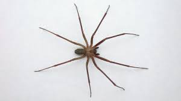

# Proyecto Spider para graficas computacionales

## En este proyecto haré una araña capaz de moverse utilizando unity 3D y figuras primitivas

### referencia:

#### para el terreno utilice las texturas de a dogs life software Outdoor Ground Textures
#### para la construccion de la araña utilice las figuras simples de unity especialmente cilindros y esferas, en las patas para simular las articulaciones utilice esferas unidas a los cilindros, yo programe el movimiento asi como la animacion y uni la camara a la araña para que esta la siga en su recorrido. 
#### al final decidi añadir unos arboles a la escena para que no se viera tan vacia, los arboles son coniferas de forst (Conifers[BOTD]).
#### link al video demostrativo: https://www.youtube.com/watch?v=pcGxJBPbvNU 

#### imagenes de referencia:

#### para mover la araña use las teclas wasd o las flechas

